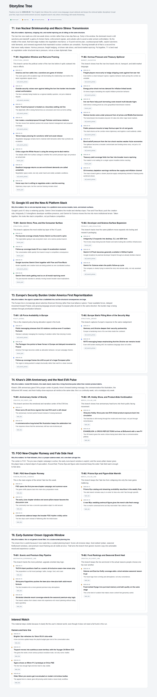

<p align="center">
  
</p>

# syft-news-skills

Turn raw Syft CLI signals into reusable editorial outputs: profile summaries, personalized briefings, storyline trees, backfill runs, and durable guidance.

This repository packages one orchestration skill plus five atomic skills for people who want to work from:

- `syft following`
- `syft top`
- `syft search`

without depending on a local Python pipeline.

## What Is This

`syft-news-skills` is a public skill pack for Codex and GitHub Copilot users who want a better workflow on top of Syft's AI-powered news system.

Instead of treating news as a flat stream of links, these skills help an agent:

- understand what the user actually follows
- generate a reusable profile from that follow graph
- write a daily edition that reflects both major events and personal interests
- organize stories into trunk-branch storyline trees
- backfill thin branches without rebuilding the whole editorial structure
- persist long-term preferences so future runs stay aligned

## Why Syft + Skills

Syft AI gives you an AI-powered news environment centered on followed topics, source-aware story pools, and a more personalized way to browse what matters. The attached product view below shows the kind of topic-centric feed the system is built around.


The CLI gives you direct access to the core surfaces behind that experience:

- `syft following` exposes the user's declared topic graph
- `syft top` exposes high-signal story pools
- `syft search` repairs gaps and deepens chronology

The skill layer is what turns those primitives into agent-ready editorial workflows with consistent outputs.

## What You Get

| Skill | What it does | User value |
| --- | --- | --- |
| `syft-news-pipeline` | Routes a request to the correct Syft-only workflow | One entry point when the user does not want to think about internal steps |
| `syft-profile-summary` | Converts `syft following` into reusable profile artifacts | Stops the user from re-explaining interests every session |
| `syft-daily-briefing` | Builds a profile-aware daily edition | Turns a noisy pool into a readable personalized briefing |
| `syft-storyline-tree` | Builds trunk-branch storyline outputs | Makes causal structure and interest-side branches easier to browse |
| `syft-storyline-backfill` | Extends existing trunks or branches | Deepens thin lines without destroying the current tree |
| `syft-guidance-rulebook` | Stores durable preferences and editorial rules | Makes future runs more stable and more personal |

## Example Outputs

These skills are designed to produce artifacts, not just transient chat answers.

Typical outputs include:

- `profiles/following_topics.md`
- `profiles/profile_summary.md`
- `briefings/daily_briefing_<date>.md`
- `storylines/storyline_tree_<date>.md`
- `storylines/storyline_tree_<date>.html`
- `storylines/storyline_tree_<date>.json`

Static preview of a real storyline tree output:



You can inspect a full storyline tree example here:

- [examples/artifacts/storyline_tree_2026-05-20.html](examples/artifacts/storyline_tree_2026-05-20.html)

That example shows the kind of editorial deliverable the tree workflow aims to produce: a readable, card-based storyline page with trunks, branches, merged timelines, and visually separated evidence lanes.

## Included Skills

| Skill | Purpose |
| --- | --- |
| `syft-news-pipeline` | Route a request to the right Syft-only workflow |
| `syft-profile-summary` | Turn `syft following` into reusable profile artifacts |
| `syft-daily-briefing` | Produce a profile-aware daily news briefing |
| `syft-storyline-tree` | Organize the news pool into trunk-branch storylines |
| `syft-storyline-backfill` | Extend a branch or trunk timeline with older or missing events |
| `syft-guidance-rulebook` | Persist durable editorial or preference rules |

## Who This Is For

Syft here refers to a CLI-driven personalized news workflow where the core available inputs are:

- `syft following` for the user's declared topic graph
- `syft top` for high-signal news pools
- `syft search` for targeted backfill and gap repair

This skill pack turns those raw Syft CLI surfaces into reusable editorial workflows with clear user value:

- build a reusable interest profile instead of re-explaining taste every session
- generate a personalized daily briefing instead of reading a flat article dump
- convert scattered news into trunk-branch storyline trees that are easier to browse and reason about
- backfill thin branches without rebuilding the whole structure
- store long-lived editorial preferences so the workflow becomes more consistent over time

This repository is for:

- Codex users who want installable skills for Syft-based profile building, daily briefings, storyline trees, and backfill workflows
- GitHub Copilot users who want repository-local or personal agent skills for the same Syft-only news workflow
- maintainers who want a reproducible skill bundle with examples, mirrored install layouts, and release assets

## Quick Start

### 1. Install Syft CLI

Install the official npm package:

```bash
npm install -g @orionarm/syft-cli
```

(Or, get it from: https://github.com/orion-arm-ai/syft-news-cli)

Then sign in and verify access:

```bash
syft login
syft status
```

If `syft` is not found locally or `syft status` fails because the CLI is missing, install the package above first before trying to install or run the skills.

### 2. Install Skills For Codex

Two supported paths:

1. Install from this GitHub repository with `$skill-installer`.

   Copyable examples:

   - install the orchestration entry point only:
     `Use $skill-installer to install https://github.com/Solatrader/syft-news-skills/tree/main/codex-skills/syft-news-pipeline`
   - install one atomic skill directly:
     `Use $skill-installer to install https://github.com/Solatrader/syft-news-skills/tree/main/codex-skills/syft-daily-briefing`
   - install the full pack:
     `Use $skill-installer to install these skill paths from the GitHub repo Solatrader/syft-news-skills: codex-skills/syft-news-pipeline, codex-skills/syft-profile-summary, codex-skills/syft-daily-briefing, codex-skills/syft-storyline-tree, codex-skills/syft-storyline-backfill, codex-skills/syft-guidance-rulebook`

2. Download a release zip, then copy the desired skill directories into your Codex skills home such as `~/.codex/skills` or the directory backed by `CODEX_HOME/skills`.

See [docs/install-codex.md](docs/install-codex.md).

### 3. First Useful Prompt

```text
Use $syft-news-pipeline to build my profile from Syft CLI only and produce today's personalized briefing.
```

## Install For GitHub Copilot

Two supported paths:

1. Copy selected skill folders from `.github/skills/` into a target repository's `.github/skills/`.
2. Copy selected skill folders into a personal skill directory such as `~/.copilot/skills` or `~/.agents/skills`.

See [docs/install-github-copilot.md](docs/install-github-copilot.md).

## Learn More

The repository includes a pushable `wiki/` directory with longer-form explanations:

- [wiki/Home.md](wiki/Home.md)
- [wiki/What-Is-Syft-AI.md](wiki/What-Is-Syft-AI.md)
- [wiki/Why-Use-Syft-CLI.md](wiki/Why-Use-Syft-CLI.md)
- [wiki/Why-Use-Syft-Skills.md](wiki/Why-Use-Syft-Skills.md)
- [wiki/Install-and-Setup.md](wiki/Install-and-Setup.md)
- [wiki/Workflow-Examples.md](wiki/Workflow-Examples.md)
- [wiki/Output-Examples.md](wiki/Output-Examples.md)
- [wiki/FAQ.md](wiki/FAQ.md)

## Repository Layout

- `assets/`: visual assets used in README and docs
- `source-skills/`: canonical source skill folders maintained in this repository
- `.github/skills/`: GitHub Copilot project-skill mirror generated from `source-skills/`
- `codex-skills/`: Codex-oriented mirror generated from `source-skills/`
- `docs/`: installation, release, and repository guidance
- `wiki/`: longer-form explanatory content stored in-repo
- `examples/`: prompt, output-shape, and artifact examples
- `scripts/`: build, validate, and release helpers

Edit `source-skills/`, then rebuild the mirrored skill roots with `scripts/build_skill_bundle.py`.
Do not hand-edit `.github/skills/` or `codex-skills/` unless you are fixing the build itself.

## Prerequisites

- `syft` is installed and available on the target machine
- `syft status` succeeds
- the user can access `syft following`, `syft top`, and `syft search`
- the user understands that final outputs are designed for Simplified Chinese by default unless they ask otherwise

If the target machine does not have Syft CLI yet, install it first with:

```bash
npm install -g @orionarm/syft-cli
syft login
syft status
```

## Build And Release

1. Update `source-skills/`.
2. Run `python scripts/build_skill_bundle.py`.
3. Run `powershell -ExecutionPolicy Bypass -File .\scripts\validate_skills.ps1`.
4. Run `powershell -ExecutionPolicy Bypass -File .\scripts\create_release_bundle.ps1`.

Release details are in [docs/release-process.md](docs/release-process.md).
First-time GitHub publishing steps are in [docs/publish-to-github.md](docs/publish-to-github.md).

## Contributing

Start with [CONTRIBUTING.md](CONTRIBUTING.md).
Repository metadata suggestions are in [docs/repo-metadata.md](docs/repo-metadata.md).

## License

This repository is licensed under Apache License 2.0.
See [LICENSE.txt](LICENSE.txt).
